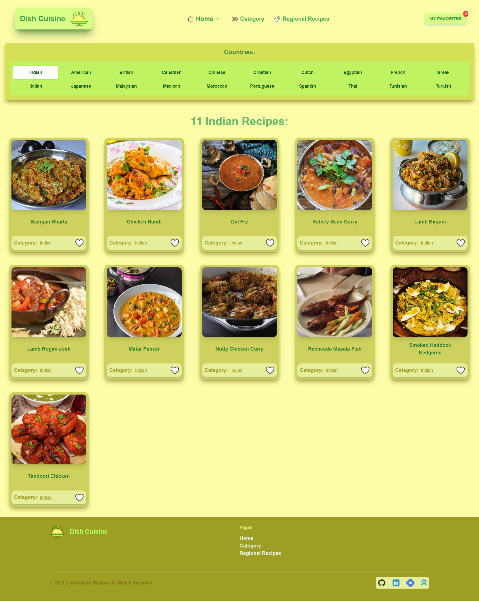

# DishCuisine: A WebApp for Recipes

### The project aims to create a recipe management application that allows users to explore various recipes, save their favorite recipes, and access them easily whenever needed. The application provides a user-friendly interface where users can search for recipes, view detailed recipe information, and organize their favorite recipes in a personalized collection.

## Features

DishCuisine WebApp offers a range of powerful features to enhance your cooking experience. Explore a vast collection of recipes and access detailed information about each recipe, including ingredients, instructions, images, and videos. Save your favorite recipes to create a personalized collection that you can easily access and manage. Discover recipes from different countries or regions and explore recipes based on meal type, cuisine, or dietary preferences. Enjoy a seamless experience across desktop and mobile devices with our responsive design. Additionally, get inspired by random recipe suggestions and find recipes by their initial letters. With our application, you can organize, save, and discover recipes effortlessly.

## Technologies Used

- **React:** A popular JavaScript library for building user interfaces.
- **React Router:** A library for handling routing in a React application.
- **Axios:** A library used for making HTTP requests to the API.
- **HTML5 & CSS3**
- **Tailwind CSS:** A powerful utility-first CSS framework for building modern & responsive user interfaces.
- **Material-UI:** A comprehensive React component library.
- **LocalStorage:** The browser's local storage mechanism used for storing favorite recipes locally.

## Demo

You can also see a live demo of this project here.

Or click the link below If above button doesn't work:

https://dish-cuisine-react-api-project.vercel.app/

## **Pages and Section of DishCuisine WebApp:**

### **1. Search Recipes**

- **Recipe Search:** Search for recipes based on keywords, or recipes' names.

## 

### **2. Recipe's Details Page**

- **Recipe Details:** Get detailed information about each recipe, including ingredients, instructions, images, and videos (if available).

## 

### **3. Explore Recipe's Categories**

- **Categorization:** Explore recipes based on meal type, cuisine, or dietary preferences.

## 

### **4. Random Recipes**

- **Random Recipes:** Explore a selection of random recipes for inspiration & a surprise culinary adventure.

## 

### **5. Search your recipes by Initials**

- **Recipe by Initials:** Easily browse recipes by their initial letters, allowing for quick access to specific recipes.

## 

### **6. Responsivenes**

- **Responsive Design:** Enjoy a seamless experience across desktop and mobile devices.

## 

### **7. Home Page:**

## 

### **8. Category Page**

## 

### **9. Country Page**

- **Country-wise Recipes:** Discover recipes from different countries or regions.

## 

### **10. Favorite Recipes Page**

- **Favorite Recipes:** Create your own curated collection of favorite recipes. Save recipes that you love and easily access them Favorite Recipe page here. Add new recipes to your favorites and remove recipes that no longer interest you. Enjoy the convenience of having all your favorite recipes in one place.

## 

## Getting Started

### Prerequisites

- Node.js and npm should be installed on your machine.

### Installation

1.  Clone the repository:

        git clone <repository-url>

2.  Navigate to the project directory:

        cd recipe-management-app

3.  Install the dependencies:

        npm install

4.  Start the development server:

        npm run dev

5.  Open the application in your browser:

        http://localhost:5173/

## Acknowledgements

- [The Meal DB API](https://www.themealdb.com/api.php) for providing the recipe data.
- [Material-UI](https://material-ui.com/) for the UI components.
